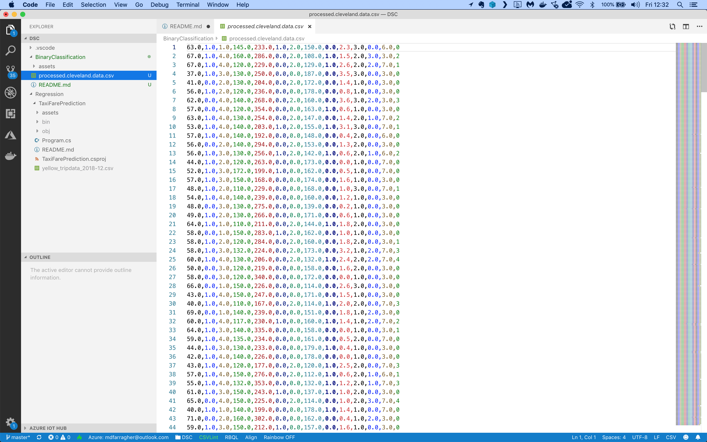

# Assignment: Predict heart disease risk

In this assignment you're going to build an app that can predict the heart disease risk in a group of patients.

Let's start by downloading the dataset. Grab the [Cleveland Heart Disease Training](https://raw.githubusercontent.com/mdfarragher/GLC0920/master/AutoML/HeartDiseasePrediction/processed_cleveland_train.csv) and [Cleveland Heart Disease Testing](https://raw.githubusercontent.com/mdfarragher/GLC0920/master/AutoML/HeartDiseasePrediction/processed_cleveland_test.csv) datasets and save them as **processed_cleveland_train.csv** and **processed_cleveland_test.csv** respectively. 

The data files look like this:



It’s a CSV file with 14 columns of information:

* Age
* Sex: 1 = male, 0 = female
* Chest Pain Type: 1 = typical angina, 2 = atypical angina , 3 = non-anginal pain, 4 = asymptomatic
* Resting blood pressure in mm Hg on admission to the hospital
* Serum cholesterol in mg/dl
* Fasting blood sugar > 120 mg/dl: 1 = true; 0 = false
* Resting EKG results: 0 = normal, 1 = having ST-T wave abnormality, 2 = showing probable or definite left ventricular hypertrophy by Estes’ criteria
* Maximum heart rate achieved
* Exercise induced angina: 1 = yes; 0 = no
* ST depression induced by exercise relative to rest
* Slope of the peak exercise ST segment: 1 = up-sloping, 2 = flat, 3 = down-sloping
* Number of major vessels (0–3) colored by fluoroscopy
* Thallium heart scan results: 3 = normal, 6 = fixed defect, 7 = reversible defect
* Diagnosis of heart disease: 0 = normal risk, 1 = elevated risk

The first 13 columns are patient diagnostic information, and the last column is the diagnosis: 0 means a healthy patient, and 1 means an elevated risk of heart disease.

You are going to build a binary classification machine learning model that reads in all 13 columns of patient information, and then makes a prediction for the heart disease risk.

Let’s get started. You need to build a new application from scratch by opening a terminal and creating a new NET Core console project:

```bash
$ dotnet new console -o Heart
$ cd Heart
```

Now install the following ML.NET packages:

```bash
$ dotnet add package Microsoft.ML
$ dotnet add package Microsoft.ML.AutoML
```

Now you are ready to add some classes. You’ll need one to hold patient info, and one to hold your model predictions.

Modify the Program.cs file like this:

```csharp
using System;
using System.IO;
using Microsoft.ML;
using Microsoft.ML.Data;
using Microsoft.ML.AutoML;

namespace Heart
{
    /// <summary>
    /// The HeartData record holds one single heart data record.
    /// </summary>
    public class HeartData 
    {
        [LoadColumn(0)] public float Age { get; set; }
        [LoadColumn(1)] public float Sex { get; set; }
        [LoadColumn(2)] public float Cp { get; set; }
        [LoadColumn(3)] public float TrestBps { get; set; }
        [LoadColumn(4)] public float Chol { get; set; }
        [LoadColumn(5)] public float Fbs { get; set; }
        [LoadColumn(6)] public float RestEcg { get; set; }
        [LoadColumn(7)] public float Thalac { get; set; }
        [LoadColumn(8)] public float Exang { get; set; }
        [LoadColumn(9)] public float OldPeak { get; set; }
        [LoadColumn(10)] public float Slope { get; set; }
        [LoadColumn(11)] public float Ca { get; set; }
        [LoadColumn(12)] public float Thal { get; set; }
        [LoadColumn(13)] public bool Label { get; set; }
    }

    /// <summary>
    /// The HeartPrediction class contains a single heart data prediction.
    /// </summary>
    public class HeartPrediction
    {
        [ColumnName("PredictedLabel")] public bool Prediction;
        public float Probability;
        public float Score;
    }

    // the rest of the code goes here....
}
```
The **HeartData** class holds one single patient record. Note how each field is tagged with a **LoadColumn** attribute that tells the CSV data loading code which column to import data from.

There's also a **HeartPrediction** class which will hold a single heart disease prediction. There's a boolean **Prediction**, a **Probability** value, and the **Score** the model will assign to the prediction.

Now you're going to load the training data in memory:

```csharp
/// <summary>
/// The application class.
/// </summary>
public class Program
{
    // filenames for training and test data
        private static string trainDataPath = Path.Combine(Environment.CurrentDirectory, "processed_cleveland_train.csv");
        private static string testDataPath = Path.Combine(Environment.CurrentDirectory, "processed_cleveland_test.csv");

    /// <summary>
    /// The main applicaton entry point.
    /// </summary>
    /// <param name="args">The command line arguments.</param>
    public static void Main(string[] args)
    {
        // set up a machine learning context
        var context = new MLContext();

        // load data
        Console.WriteLine("Loading data...");
        var trainData = context.Data.LoadFromTextFile<HeartData>(trainDataPath, hasHeader: true, separatorChar: ',');
        var testData = context.Data.LoadFromTextFile<HeartData>(testDataPath, hasHeader: true, separatorChar: ',');

        // the rest of the code goes here....
    }
}
```
This code uses the method **LoadFromTextFile** to load the CSV data files directly into memory. The class field annotations tell the method how to store the loaded data in the **HeartData** class.

Now you’re ready to start auto-training the machine learning model:

```csharp
// run an automl experiment on the training data
uint timeout = 60;
Console.WriteLine($"Discovering models for {timeout} seconds...");
var results = context
    .Auto()
    .CreateBinaryClassificationExperiment(timeout)
    .Execute(trainData, "Label");
Console.WriteLine($"  Best model is: {results.BestRun.TrainerName}");


// the rest of the code goes here....
```

The **Auto().CreateBinaryClassificationExperiment** method sets up an AutoML machine learning experiment using binary classification. The AutoML engine will try out different combinations of data processing pipelines and training algorithms, and tweak hyperparameters until it finds an optimal solution for the dataset. 

Note the timeout **parameter** which specifies that we give the AutoML engine 60 seconds to find a solution. 

After the experiment has completed, the best result is available in the **BestRun** property and we can use it to display **TrainerName**: the name of the training algorithm in the best performing machine learning pipeline.   

You now have a fully- trained model discovered by AutoML with optimal hyperparameters for the training dataset. So now it's time to take the test data, predict the diagnosis for each patient, and calculate the accuracy metrics of the model:

```csharp
// make predictions for the test data set
Console.WriteLine("Evaluating model...");
var predictions = results.BestRun.Model.Transform(testData);

// compare the predictions with the ground truth
var metrics = context.BinaryClassification.Evaluate(
    data: predictions, 
    labelColumnName: "Label", 
    scoreColumnName: "Score");

// report the results
Console.WriteLine($"  Accuracy:          {metrics.Accuracy}");
Console.WriteLine($"  Auc:               {metrics.AreaUnderRocCurve}");
Console.WriteLine($"  Auprc:             {metrics.AreaUnderPrecisionRecallCurve}");
Console.WriteLine($"  F1Score:           {metrics.F1Score}");
Console.WriteLine($"  LogLoss:           {metrics.LogLoss}");
Console.WriteLine($"  LogLossReduction:  {metrics.LogLossReduction}");
Console.WriteLine($"  PositivePrecision: {metrics.PositivePrecision}");
Console.WriteLine($"  PositiveRecall:    {metrics.PositiveRecall}");
Console.WriteLine($"  NegativePrecision: {metrics.NegativePrecision}");
Console.WriteLine($"  NegativeRecall:    {metrics.NegativeRecall}");
Console.WriteLine();

// the rest of the code goes here....
```

This code grabs the best performing model in **BestRun.Model** and calls **Transform** to set up a diagnosis for every patient in the set, and **Evaluate** to compare these predictions to the ground truth and automatically calculate all evaluation metrics:

* **Accuracy**: this is the number of correct predictions divided by the total number of predictions.
* **AreaUnderRocCurve**: a metric that indicates how accurate the model is: 0 = the model is wrong all the time, 0.5 = the model produces random output, 1 = the model is correct all the time. An AUC of 0.8 or higher is considered good.
* **AreaUnderPrecisionRecallCurve**: an alternate AUC metric that performs better for heavily imbalanced datasets with many more negative results than positive.
* **F1Score**: this is a metric that strikes a balance between Precision and Recall. It’s useful for imbalanced datasets with many more negative results than positive.
* **LogLoss**: this is a metric that expresses the size of the error in the predictions the model is making. A logloss of zero means every prediction is correct, and the loss value rises as the model makes more and more mistakes.
* **LogLossReduction**: this metric is also called the Reduction in Information Gain (RIG). It expresses the probability that the model’s predictions are better than random chance.
* **PositivePrecision**: also called ‘Precision’, this is the fraction of positive predictions that are correct. This is a good metric to use when the cost of a false positive prediction is high.
* **PositiveRecall**: also called ‘Recall’, this is the fraction of positive predictions out of all positive cases. This is a good metric to use when the cost of a false negative is high.
* **NegativePrecision**: this is the fraction of negative predictions that are correct.
* **NegativeRecall**: this is the fraction of negative predictions out of all negative cases.

When monitoring heart disease, you definitely want to avoid false negatives because you don’t want to be sending high-risk patients home and telling them everything is okay.

You also want to avoid false positives, but they are a lot better than a false negative because later tests would probably discover that the patient is healthy after all.

To wrap up, You’re going to create a new patient record and ask the model to make a prediction:

```csharp
// set up a prediction engine
Console.WriteLine("Making a prediction for a sample patient...");
var predictionEngine = context.Model.CreatePredictionEngine<HeartData, HeartPrediction>(results.BestRun.Model);

// create a sample patient
var heartData = new HeartData()
{ 
    Age = 36.0f,
    Sex = 1.0f,
    Cp = 4.0f,
    TrestBps = 145.0f,
    Chol = 210.0f,
    Fbs = 0.0f,
    RestEcg = 2.0f,
    Thalac = 148.0f,
    Exang = 1.0f,
    OldPeak = 1.9f,
    Slope = 2.0f,
    Ca = 1.0f,
    Thal = 7.0f,
};

// make the prediction
var prediction = predictionEngine.Predict(heartData);

// report the results
Console.WriteLine($"  Age: {heartData.Age} ");
Console.WriteLine($"  Sex: {heartData.Sex} ");
Console.WriteLine($"  Cp: {heartData.Cp} ");
Console.WriteLine($"  TrestBps: {heartData.TrestBps} ");
Console.WriteLine($"  Chol: {heartData.Chol} ");
Console.WriteLine($"  Fbs: {heartData.Fbs} ");
Console.WriteLine($"  RestEcg: {heartData.RestEcg} ");
Console.WriteLine($"  Thalac: {heartData.Thalac} ");
Console.WriteLine($"  Exang: {heartData.Exang} ");
Console.WriteLine($"  OldPeak: {heartData.OldPeak} ");
Console.WriteLine($"  Slope: {heartData.Slope} ");
Console.WriteLine($"  Ca: {heartData.Ca} ");
Console.WriteLine($"  Thal: {heartData.Thal} ");
Console.WriteLine();
Console.WriteLine($"Prediction: {(prediction.Prediction ? "Elevated heart disease risk" : "Normal heart disease risk" )} ");
Console.WriteLine($"Probability: {prediction.Probability:P2} ");
```

This code uses the **CreatePredictionEngine** method to set up a prediction engine. The two type arguments are the input data class and the class to hold the prediction. And once the prediction engine is set up, you can simply call **Predict** to make a single prediction.

The code creates a patient record for a 36-year old male with asymptomatic chest pain and a bunch of other medical info. What’s the model going to predict?

Time to find out. Go to your terminal and run your code:

```bash
$ dotnet run
```

What results do you get? What is your accuracy, precision, recall, AUC, AUCPRC, and F1 value?

Is this dataset balanced? Which metrics should you use to evaluate your model? And what do the values say about the accuracy of your model? 

And what about our patient? What did your model predict?

Think about the code in this assignment. How could you improve the accuracy of the model? What are your best AUC and AUCPRC values? 

Share your results in our group!
