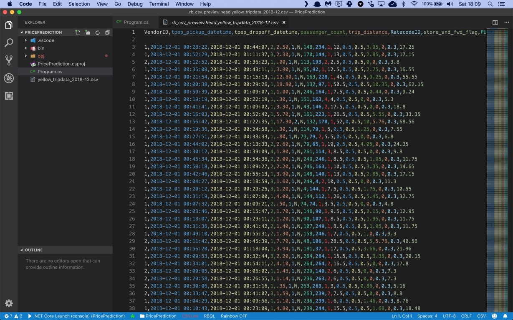
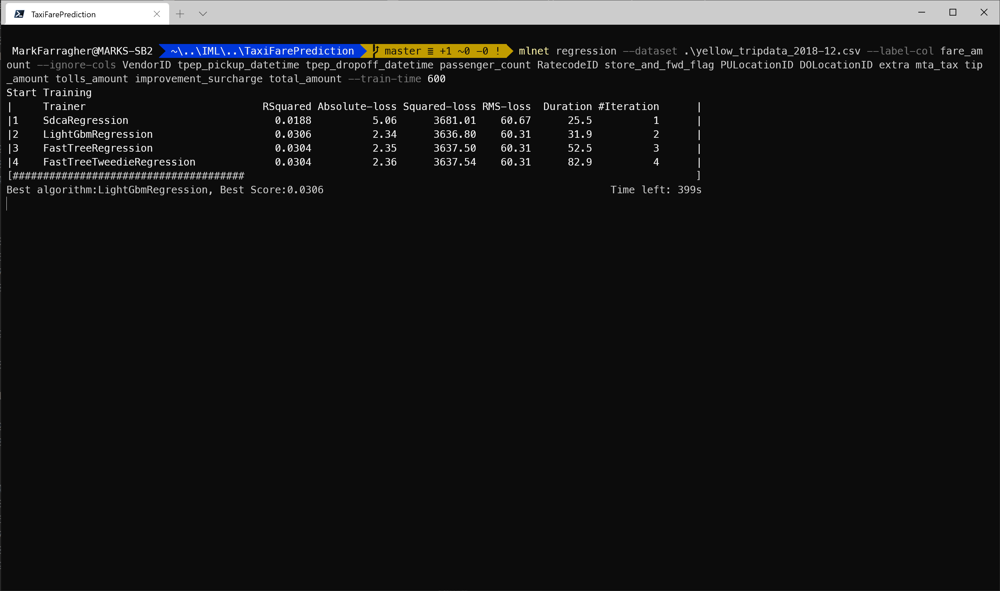
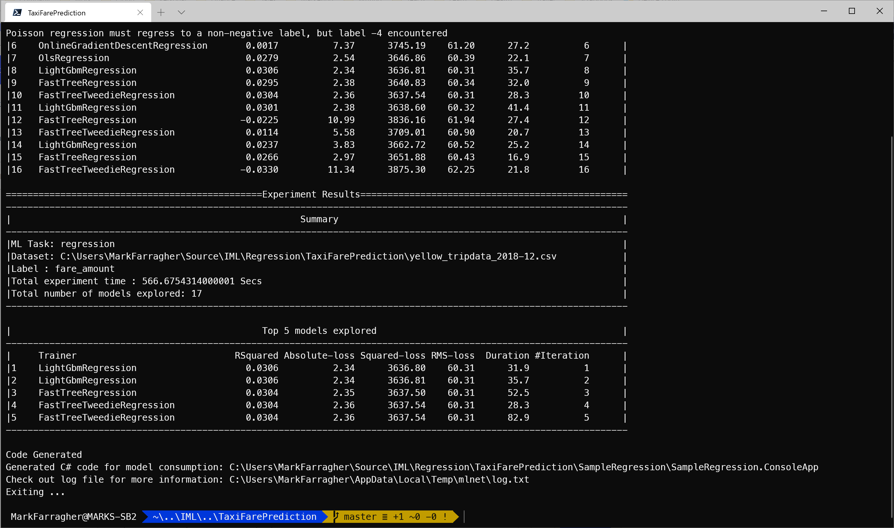
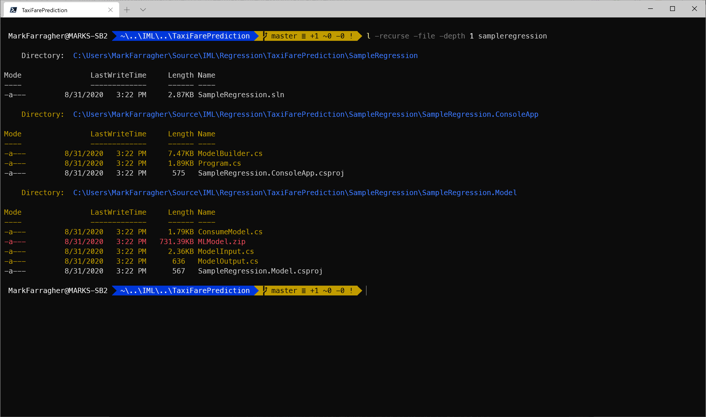
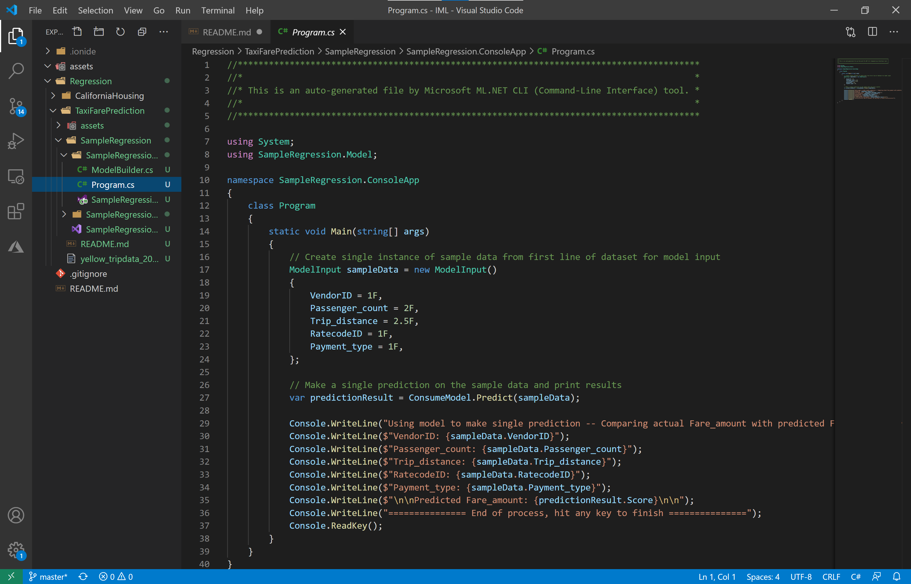
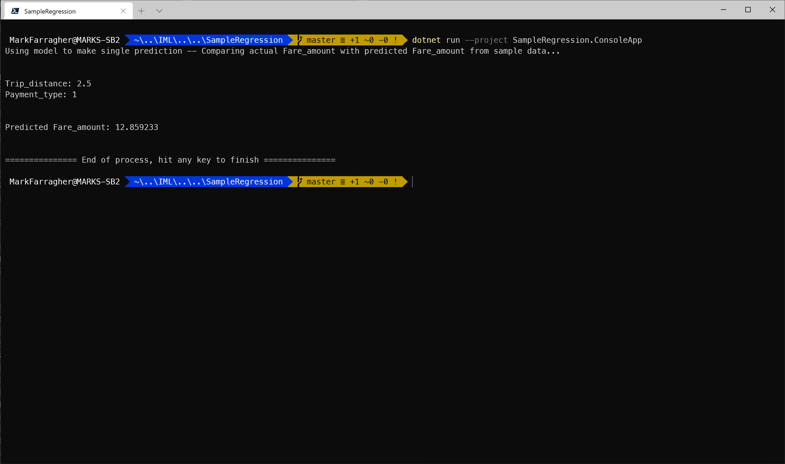
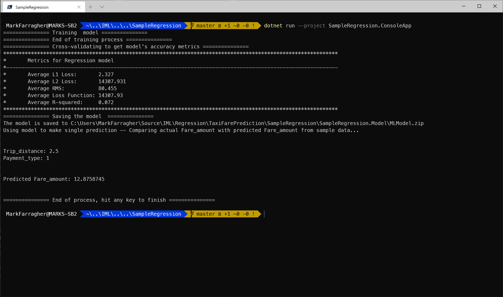

# Assignment: Predict New York taxi fares

The New York City Taxi and Limousine Commission (TLC), created in 1971, is the agency responsible for licensing and regulating New York City's yellow taxi cabs, for-hire vehicles, commuter vans, and paratransit vehicles. Over 200,000 TLC licensed drivers complete approximately 1,000,000 trips each day. To operate for hire, drivers must first undergo a background check, have a safe driving record, and complete 24 hours of driver training. 

In partnership with the New York City Department of Information Technology and Telecommunications, TLC has published millions of trip records from both yellow and green taxis. The taxi trip records include fields capturing pick-up and drop-off dates/times, pick-up and drop-off locations, trip distances, itemized fares, rate types, payment types, and driver-reported passenger counts. 

In this assignment you're going to use the TLC data files to build a model that can predict the fare of any taxi trip in the New York city area.

## Get the dataset

Let's start by downloading the dataset. Grab the [Yellow Taxi Trip Records from December 2018](https://s3.amazonaws.com/nyc-tlc/trip+data/yellow_tripdata_2018-12.csv) and save it as **yellow_tripdata_2018-12.csv**. 

This is a CSV file with 8 million records that looks like this:
 


There are a lot of columns with interesting information in this data file, but you will only train on the following:

* Column 0: The data provider vendor ID
* Column 1: The pickup date and time
* Column 2: The dropoff date and time
* Column 3: The number of passengers
* Column 4: The trip distance
* Column 5: The rate code (standard, JFK, Newark, …)
* Column 9: The payment type (credit card, cash, …)
* Column 10: The fare amount
* Column 13: Any tip given
* Column 14: Any included tolls
* Column 16: The total amound paid

You are going to build a machine learning model in C# that will use columns 0, 3, 4, 5, and 9 as input, and uses them to predict the taxi fare for every trip. Then you’ll compare the predicted fares with the actual taxi fares in column 10, and evaluate the accuracy of your model.

Note that we're using column 10 as the label, which means we are ignoring taxes, tolls, and tips. We're trying to predict only the raw fare amount. 

To start, please open a console window. You are going to create a folder to hold the file of this assignment:

```bash
mkdir TaxiFarePrediction
cd TaxiFarePrediction
```

Also make sure to copy the dataset file into this folder. 

## Train the model

Now you're ready to start training a machine learning model. To keep things simple we're only going to look at columns 0, 3, 4, 5, 9, and 10 for now and ignore everything else in the dataset. 

Type the following command in your console window:

```bash
mlnet regression --dataset .\yellow_tripdata_2018-12.csv --label-col fare_amount --ignore-cols VendorID tpep_pickup_datetime tpep_dropoff_datetime passenger_count RatecodeID store_and_fwd_flag PULocationID DOLocationID extra mta_tax tip_amount tolls_amount improvement_surcharge total_amount --train-time 600
```

**mlnet** is the Microsoft ML.NET CLI tool. It's a command-line tool that can train machine learning models from CSV datafiles directly and produce all the C# code we need to train a model and then consume that fully-trained model.

Let's take a closer look at the command-line arguments:

* **--dataset**: the dataset to use for training the machine learning model. This can be a comma-separated or tab-separated text file.
* **--label-col**: the column in the dataset that contains the label we're trying to predict.
* **--ignore-cols**: an optional list of columns in the dataset to ignore.
* **--train-time**: the maximum number of seconds to spend training machine learning models. 

So what we're doing here is trying to predict the **fare_amount** column. We're ignoring every other column in the dataset except **trip_distance** and **payment_type**. 

Here's what the running app looks like in my Windows Terminal:



The tool has loaded the training dataset and is now randomly trying out machine learning algorithms and algorithm parameters to create the best possible fare predictions.

You can see that at the point of the screenshot, the tool has already tried out 4 different machine learning algorithms, these are listed in the **Training** column. 

The performance of each algorithm is listed in the **RSquared**, **Absolute-loss**, **Squared-loss** and **RMS-loss** columns. The tool uses the RSquared value to keep track of the best algorithm to date, which is shown in the final line of text. 

In the screenshot, the best algorithm is LightGbmRegression which achieved an RSquared value of 0.0306 (bigger is better). This happened in experiment 2. 

The tool continues to try out algorithms until a set time period has expired. We have set the period to 600 seconds, at which the tool selects the winning algorithm.

Here's what that looks like on my computer:



After 16 experiments, the tool has selected LightGbmRegression as the winning algorithm. It achieved a winning RSquared value of 0.0306.

Take a pause here and appreciate what the CLI tool just did. It tried out 10 different machine learning models, trained each of them with 8 million taxi trip records and got the average prediction error down to $2.34. And all of this in only 10 minutes of training time. 

The tool also reports that it has created a C# app for us that can either train this model from scratch, or use a pre-trained model to predict the fare of any trip. The project files have been placed in the **SampleRegression** folder.

## Inspect the C# code

Let's check the files agail that the CLI tool has created. Run the following Powershell command on the console:

```bash
l -recurse -file -depth 1 sampleregression
```

You'll see the following output:



There are three folders:

* **SampleRegression**: The solution folder for the generated app containing a single SLN file for Visual Studio.
* **SampleRegression/SampleRegression.ConsoleApp**: A console project that consumes the fully-trained model to make a prediction. There's also a **ModelBuilder.cs** file which can train the model from scratch.
* **SampleRegression/SampleRegression.Model**: A library project with helper classes for training and consuming the model. There's also a ZIP file with a saved copy of the fully-trained model which can be consumed right away without any further training. 

This is exactly the same folder structure as we saw in the previous code assignment. 

So again, you have two possible scenarios for building your own taxi fare prediction app:

* Load the ZIP file with the fully-trained model and start making predictions right away. You'll need to link the **SampleRegression.Model** project into your own solution, and then use the code in **SampleRegression.ConsoleApp/Program.cs** as a starting point to consume the model. 
* Train your own model from scratch. You'll need to link the **SampleRegression.Model** project into your own solution, and then use the code in **SampleRegression.ConsoleApp/ModelBuilder.cs** as a starting point to train your model. You'll also need to put the CSV training file in your project directory. 

The first scenario is fine if your training data is static and not expected to change. The second scenario is useful if your training data is very dynamic and changes all the time, necessitating constant retraining. 

Another option is to start with the ZIP file, and then rerun the CLI tool whenever the taxi market has changed due to a significant disruption. This will produce a new ZIP file that you can simply drop into your project folder to update the predictions. 

### The SampleRegression.ConsoleApp project

We've already inspected the code of the **SampleRegression** project in the previous code assignment. 

But let's do a quick check anyway to see if any part of the code has changed due to us using a new dataset in this assignment. 

Go to the SampleRegression folder and open Visual Studio code:

```bash
cd SampleRegression
code .
```

In Visual Studio Code, select the **SampleRegression.ConsoleApp/Program.cs** file. You'll see something like this:



The Program.cs file contains a very short code snippet for using the fully-trained model to make a prediction. 

The Main method starts like this:

```csharp
// Create single instance of sample data from first line of dataset for model input
ModelInput sampleData = new ModelInput()
{
    Trip_distance = 2.5F,
    Payment_type = 1F,
};
```

This code snippet is different from what we saw in the previous assignment. Because we're using a different dataset, we are now seeing different fields. 

The **ModelInput** class contains all fields we did not ignore while running the ML.NET CLI tool. And the values are random numbers picked by the tool. We are travelling 2.5 miles and we pay by credit card. 

The next line to make a prediction hasn't changed. But the code to display the results has: 

```csharp
Console.WriteLine("Using model to make single prediction -- Comparing actual Fare_amount with predicted Fare_amount from sample data...\n\n");
Console.WriteLine($"Trip_distance: {sampleData.Trip_distance}");
Console.WriteLine($"Payment_type: {sampleData.Payment_type}");
Console.WriteLine($"\n\nPredicted Fare_amount: {predictionResult.Score}\n\n");
Console.WriteLine("=============== End of process, hit any key to finish ===============");
```

This code displays the fields of the test record, and then shows the **Score** field which again contains the predicted fare_amount. 

Let's run this app to make sure everything works. 

Type the following on the console:

```bash
dotnet run --project SampleRegression.ConsoleApp
```

This will run the app and show the following:



Given a 2.5 mile trip and paying by credit card, the model predicts a fare amount of $12.86.

Trust me, that's cheap. Here in Amsterdam where I live, you would pay that amount for driving 100 meters 😅

### The SampleRegression.Model project

Now let's take a peek at the **ModelInput** class. 

Select the **SampleRegression.Model/ModelInput.cs** file in Visual Studio Code. You'll see that it looks like this:

```csharp
public class ModelInput
{
    [ColumnName("VendorID"), LoadColumn(0)]
    public float VendorID { get; set; }

    [ColumnName("tpep_pickup_datetime"), LoadColumn(1)]
    public string Tpep_pickup_datetime { get; set; }

    [ColumnName("tpep_dropoff_datetime"), LoadColumn(2)]
    public string Tpep_dropoff_datetime { get; set; }

    [ColumnName("passenger_count"), LoadColumn(3)]
    public float Passenger_count { get; set; }

    [ColumnName("trip_distance"), LoadColumn(4)]
    public float Trip_distance { get; set; }

    [ColumnName("RatecodeID"), LoadColumn(5)]
    public float RatecodeID { get; set; }

    [ColumnName("store_and_fwd_flag"), LoadColumn(6)]
    public bool Store_and_fwd_flag { get; set; }

    [ColumnName("PULocationID"), LoadColumn(7)]
    public float PULocationID { get; set; }

    [ColumnName("DOLocationID"), LoadColumn(8)]
    public float DOLocationID { get; set; }

    [ColumnName("payment_type"), LoadColumn(9)]
    public float Payment_type { get; set; }

    [ColumnName("fare_amount"), LoadColumn(10)]
    public float Fare_amount { get; set; }

    [ColumnName("extra"), LoadColumn(11)]
    public float Extra { get; set; }

    [ColumnName("mta_tax"), LoadColumn(12)]
    public float Mta_tax { get; set; }

    [ColumnName("tip_amount"), LoadColumn(13)]
    public float Tip_amount { get; set; }

    [ColumnName("tolls_amount"), LoadColumn(14)]
    public float Tolls_amount { get; set; }

    [ColumnName("improvement_surcharge"), LoadColumn(15)]
    public float Improvement_surcharge { get; set; }

    [ColumnName("total_amount"), LoadColumn(16)]
    public float Total_amount { get; set; }
}
```

Pretty much what we expected: a class with properties for every column in the dataset. Again, note the **LoadColumn** attributes that defines from which CSV data column the property should be loaded. 

Now look at the pickup and dropoff times. The CLI tool could not figure out the type of data in this column (date and time information) and so has decided to load them as **strings**. This is obviously wrong, but since we're ignoring these columns during training, it does not affect our results.

And look at the **Store_and_fwd_flag** field. The tool found only 0 or 1 values in this column and has figured out that it can load them as **bool**. 

Data loading with the CLI tool is always a mixed bag. The tool does its best to load every data column and has some built-in intelligence to recognize various data types. But it's not perfect, and in this case it did not realize that columns 1 and 2 contain datetime values. 

So you should always verify the code produced by the ML.NET CLI tool and manually tweak the data loading logic if neccesary. 

Now let's continue our code inspection. 

The **ModelOutput.cs** file has not changed. It still looks like this:

```csharp
public class ModelOutput
{
    public float Score { get; set; }
}
```

And the **ConsumeModel** class is also almost identical to what we saw in the previous assignment. 

The method sets up a lazy-loaded prediction engine:

```csharp
private static Lazy<PredictionEngine<ModelInput, ModelOutput>> PredictionEngine = new Lazy<PredictionEngine<ModelInput, ModelOutput>>(CreatePredictionEngine);
```

And uses a method called **CreatePredictionEngine** to initialize the engine:

```csharp
public static PredictionEngine<ModelInput, ModelOutput> CreatePredictionEngine()
{
    // Create new MLContext
    MLContext mlContext = new MLContext();

    // Load model & create prediction engine
    string modelPath = @"C:\Users\MarkFarragher\Source\IML\Regression\TaxiFarePrediction\SampleRegression\SampleRegression.Model\MLModel.zip";
    ITransformer mlModel = mlContext.Model.Load(modelPath, out var modelInputSchema);
    var predEngine = mlContext.Model.CreatePredictionEngine<ModelInput, ModelOutput>(mlModel);

    return predEngine;
}
```

This is pretty much the same code as in the previous assignment, only the path to the ZIP file has changed. 

With the engine set up, we can now define the **Predict** method like this:

```csharp
// For more info on consuming ML.NET models, visit https://aka.ms/mlnet-consume
// Method for consuming model in your app
public static ModelOutput Predict(ModelInput input)
{
    ModelOutput result = PredictionEngine.Value.Predict(input);
    return result;
}
```

The method is 100% identical to the previous assignment. 

You can see that the code to train and run a machine learning model is pretty much the same every time. The only major difference is in the definition of the **ModelInput** class, which must match the columns in the training dataset.

### The ModelBuilder class

Finally, let's see if the **ModelBuilder** class in the ConsoleApp project has changed.

Select the **SampleRegression.ConsoleApp/ModelBuilder.cs** file in Visual Studio Code. 

You'll see that the class starts like this:

```csharp
public static class ModelBuilder
{
    private static string TRAIN_DATA_FILEPATH = @"C:\Users\MarkFarragher\Source\IML\Regression\TaxiFarePrediction\yellow_tripdata_2018-12.csv";
    private static string MODEL_FILEPATH = @"C:\Users\MarkFarragher\Source\IML\Regression\TaxiFarePrediction\SampleRegression\SampleRegression.Model\MLModel.zip";
    // Create MLContext to be shared across the model creation workflow objects 
    // Set a random seed for repeatable/deterministic results across multiple trainings.
    private static MLContext mlContext = new MLContext(seed: 1);

    // ...
}
```

There's only a single data path now because we don't have separate training and testing datasets. The rest of the code is the same.

Now let's look at the **CreateModel** method which performs a complete end-to-end training run:

```csharp
public static void CreateModel()
{
    // Load Data
    IDataView trainingDataView = mlContext.Data.LoadFromTextFile<ModelInput>(
                                    path: TRAIN_DATA_FILEPATH,
                                    hasHeader: true,
                                    separatorChar: ',',
                                    allowQuoting: true,
                                    allowSparse: false);

    // Build training pipeline
    IEstimator<ITransformer> trainingPipeline = BuildTrainingPipeline(mlContext);

    // Train Model
    ITransformer mlModel = TrainModel(mlContext, trainingDataView, trainingPipeline);

    // Evaluate quality of Model
    Evaluate(mlContext, trainingDataView, trainingPipeline);

    // Save model
    SaveModel(mlContext, mlModel, MODEL_FILEPATH, trainingDataView.Schema);
}
```

This looks almost identical to the previous assignment, except that we're only loading a single dataset. There is no separate testing file. 

But take a closer look. After training, the code now calls the **Evaluate** method. In the previous assignment, this part of the code called **EvaluateModel**.

So something fundamental seems to have changed with regards to evaluating the trained model. We'll get to that in a second. 

First, let's look at the **BuildTrainingPipeline** method:

```csharp
public static IEstimator<ITransformer> BuildTrainingPipeline(MLContext mlContext)
{
    // Data process configuration with pipeline data transformations 
    var dataProcessPipeline = mlContext.Transforms.Concatenate("Features", new[] { "trip_distance", "payment_type" });
    // Set the training algorithm 
    var trainer = mlContext.Regression.Trainers.LightGbm(labelColumnName: "fare_amount", featureColumnName: "Features");

    var trainingPipeline = dataProcessPipeline.Append(trainer);

    return trainingPipeline;
}
```

We're seeing similar machine learning pipeline components as in the previous code assignment: 

* A **Concatenate** component which combines all input data columns into a single column called 'Features'. This is a required step because ML.NET can only train on a single input column.
* A **LightGbm** regression training algorithm which will train the model. 

The **TrainModel** method is unchanged:

```csharp
public static ITransformer TrainModel(MLContext mlContext, IDataView trainingDataView, IEstimator<ITransformer> trainingPipeline)
{
    Console.WriteLine("=============== Training  model ===============");

    ITransformer model = trainingPipeline.Fit(trainingDataView);

    Console.WriteLine("=============== End of training process ===============");
    return model;
}
```

This is the same call to the **Fit** method that trains the model with the machine learning pipeline using the training data. The return value is a fully-trained machine learning model.

But now let's check out the **Evaluate** method:

```csharp
private static void Evaluate(MLContext mlContext, IDataView trainingDataView, IEstimator<ITransformer> trainingPipeline)
{
    // Cross-Validate with single dataset (since we don't have two datasets, one for training and for evaluate)
    // in order to evaluate and get the model's accuracy metrics
    Console.WriteLine("=============== Cross-validating to get model's accuracy metrics ===============");
    var crossValidationResults = mlContext.Regression.CrossValidate(trainingDataView, trainingPipeline, numberOfFolds: 5, labelColumnName: "fare_amount");
    PrintRegressionFoldsAverageMetrics(crossValidationResults);
}
```

What's going on here?

This is called **K-Fold Cross Validation**. It's a technique you can use to evaluating a model using the training dataset, when you don't have a separate testing dataset. 

We will take a deep dive into cross validation in a later lecture. For now, be aware that cross validation repeatedly trains the model using different parts of the dataset for training and testing. 

The number of cross validation training runs is controlled by the **numberOfFolds** argument. So this code repeatedly trains the model five times.

The code for printing cross validation regression metrics looks like this:

```csharp
public static void PrintRegressionFoldsAverageMetrics(IEnumerable<TrainCatalogBase.CrossValidationResult<RegressionMetrics>> crossValidationResults)
{
    var L1 = crossValidationResults.Select(r => r.Metrics.MeanAbsoluteError);
    var L2 = crossValidationResults.Select(r => r.Metrics.MeanSquaredError);
    var RMS = crossValidationResults.Select(r => r.Metrics.RootMeanSquaredError);
    var lossFunction = crossValidationResults.Select(r => r.Metrics.LossFunction);
    var R2 = crossValidationResults.Select(r => r.Metrics.RSquared);

    Console.WriteLine($"*************************************************************************************************************");
    Console.WriteLine($"*       Metrics for Regression model      ");
    Console.WriteLine($"*------------------------------------------------------------------------------------------------------------");
    Console.WriteLine($"*       Average L1 Loss:       {L1.Average():0.###} ");
    Console.WriteLine($"*       Average L2 Loss:       {L2.Average():0.###}  ");
    Console.WriteLine($"*       Average RMS:           {RMS.Average():0.###}  ");
    Console.WriteLine($"*       Average Loss Function: {lossFunction.Average():0.###}  ");
    Console.WriteLine($"*       Average R-squared:     {R2.Average():0.###}  ");
    Console.WriteLine($"*************************************************************************************************************");
}
```

This method displays the RSquared score, the absolute loss, the squared loss and the RMS loss, just like the code in the previous assignment.

But now each metric is calculated by taking all the values from each cross validation run, and then computing the average. 

Let's take this code for a spin and see what happens. 

Select the **SampleRegression.ConsoleApp/Program.cs** file in Visual Studio Code, and add the following code to the top of the Main method, before any other code:

```csharp
// train the model from scratch
ModelBuilder.CreateModel();
```

Now execute the following command on the console:

```bash
dotnet run --project SampleRegression.ConsoleApp
```

This will run the app and show the following:



Note the new output at the top. The model gets trained from scratch, evaluated, and then saved to a ZIP file. And then the model is consumed to make the single prediction.

The RSquared is now 0.072 and the RMS loss is 80.455. And we get a fare prediction for our New York trip of $12,88. This is about 2 cents more than our previous prediction. 

## Observations

Did you notice that the generated code again does not contain any input feature processing?

The payment type is an enumeration and we learned in the previous section that we're supposed to one-hot encode the column. This is not happening here.

So at the very least, we shouldo one-hot encode the **payment_type** column, and we might as well encode the  **VendorID** and **RatecodeID** columns too because they are also enumerations.

Are there any other processing steps you can think of? 

Writing C# code to process features is outside the scope of this introductionary training. But I would invite you to take a look at my [Machine Learning with C# and ML.NET course](https://www.machinelearningadvantage.com/datascience-with-csharp) where we take a deep dive into feature processing. 

## Improve the model

Remember when we ran the ML.NET CLI tool and told it to ignore all columns except trip_distance and payment_type? 

That was a bit extreme, because we're forcing the model to produce accurate fare predictions by looking only at the distance and how the customer paid. 

You can imagine that other features like the taxi vendor, the number of passengers, and the rate type (standard, trip to JFK airport, etc) will also help a lot in determining the house value. 

So lets to another run and train on those additional columns too. 

Delete the SampleRegression folder, and then run the following command:

```bash
mlnet regression --dataset .\yellow_tripdata_2018-12.csv --label-col fare_amount --ignore-cols tpep_pickup_datetime tpep_dropoff_datetime store_and_fwd_flag PULocationID DOLocationID extra mta_tax tip_amount tolls_amount improvement_surcharge total_amount --train-time 600
```

This will train a new model on the vendor ID, number of passengers, rate code, payment type and trip distance. 

Which RSquared and RMS-loss values do you get now? And which learning algorithm has the CLI tool selected? 

Feel free to try different combinations of columns to find the best possible result. 
