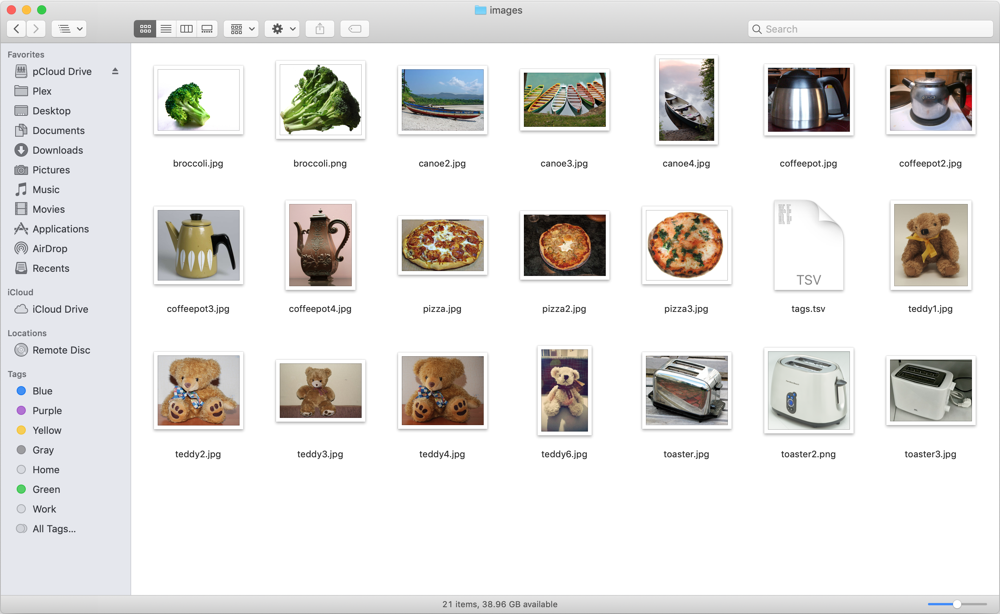
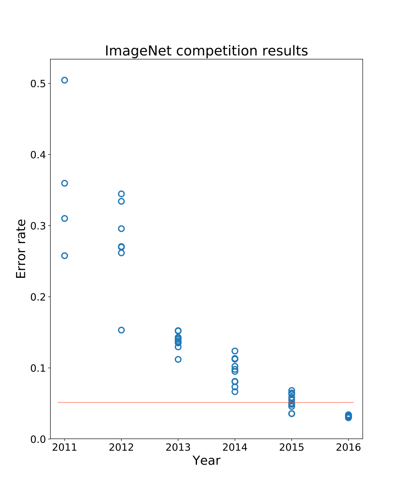
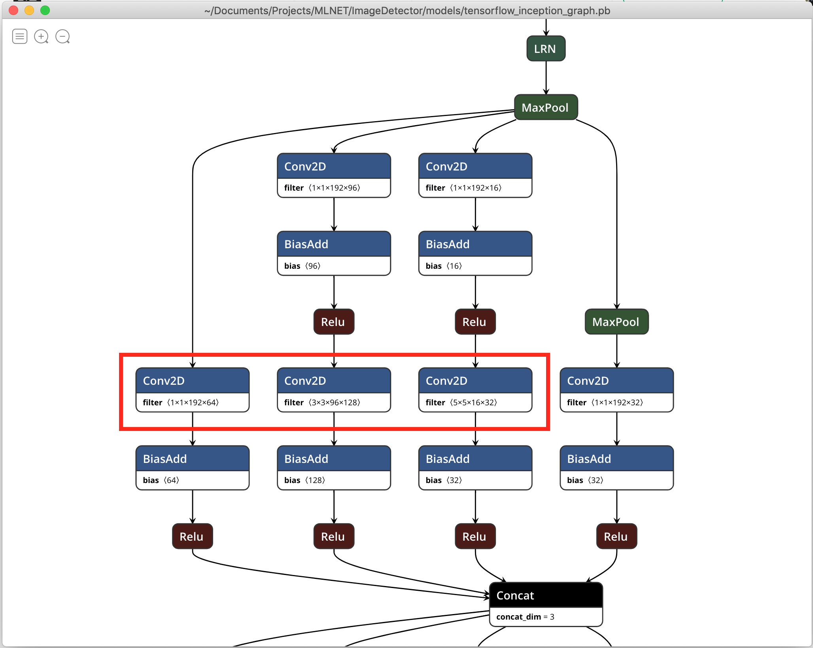
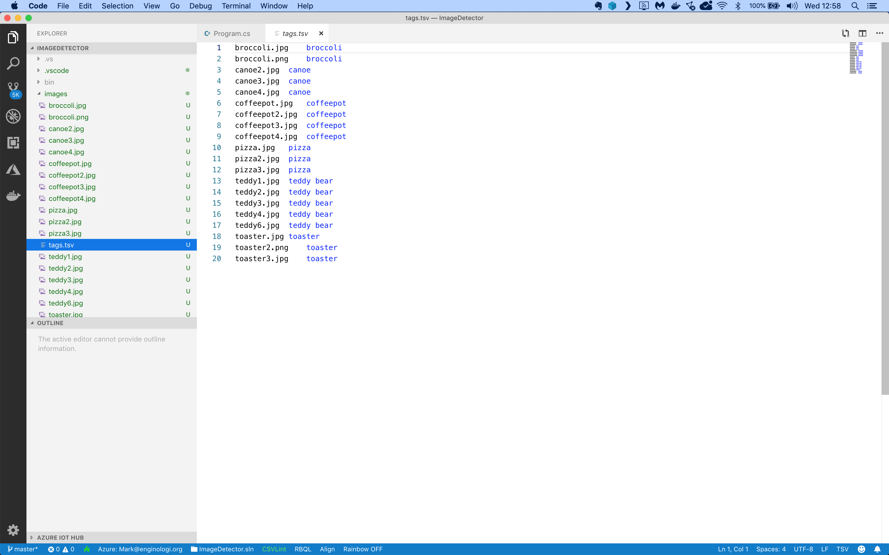
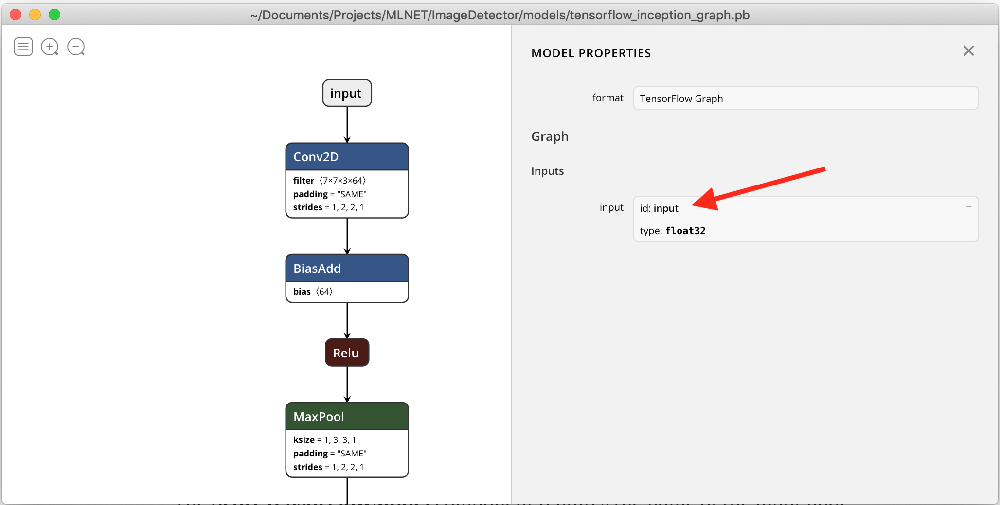
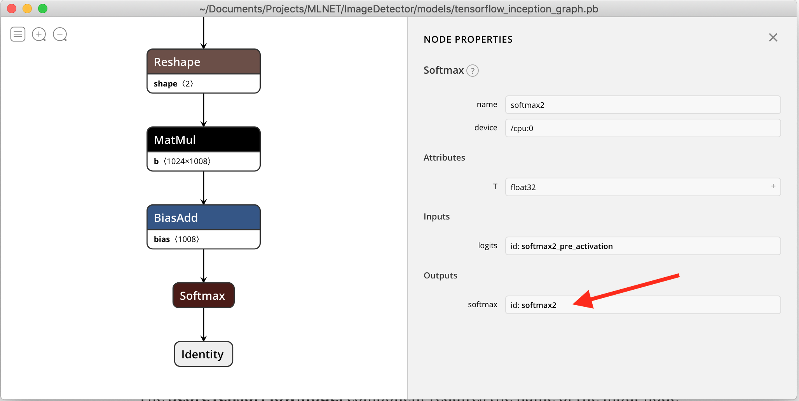
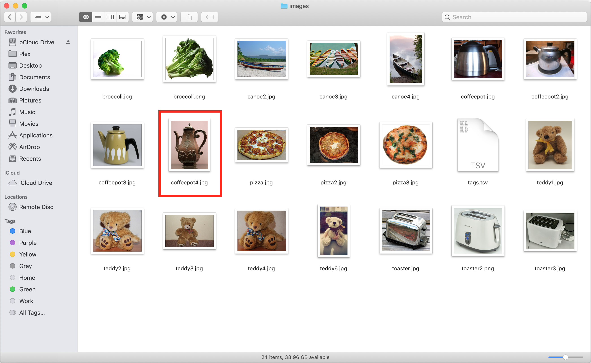

## Assignment: Detect objects in images

There’s an old saying in AI that computers are great at things that humans find hard (like doing complex math) and computers really struggle with things that humans find easy (like catching a ball or recognizing objects).
Let’s take recognizing objects as an example. Check out the following collection of images:



These 20 images depict a broccoli, a canoe, a coffee pot, a pizza, a teddy bear, and a toaster. How hard would it be to build an app that can recognize the object in every image?

Really hard, actually.

In fact, it’s so difficult that there’s an annual challenge called the **ImageNet Large Scale Visual Recognition Challenge**. The challenge requires apps to classify a collection of 1.2 million images into 1,000 unique categories.

Here are the competition results up to 2016:



The red line depicts the 5% human error rate on the image classification challenge. Only in 2015 a team finally developed an app that could beat human performance levels.

That was 4 years ago. Can we build a C# app today with ML.NET and NET Core that can do the same?

You may think that the answer is yes, but that you'll have to build a complex convolutional neural network in ML.NET, train it on the 1.2 million images in the ImageNet set, and then use the trained network to predict the 20 images in our test set.

But there’s no need to go through all that trouble. Fully-trained object-detection networks are readily available and ML.NET can easily host and run a neural network that has already been trained.

So our best course of action is to grab a TensorFlow neural network that has been trained on the ImageNet data and just drop it into ML.NET for immediate use.

You will use the **Google Inception** network in your app. What makes the Inception model unique is its use of stacked ‘Inception Modules’: special neural submodules that run convolutions with different kernel sizes in parallel, like this:



This is a single inception module shown in Netron, a popular neural network viewer (you can install Netron from here: https://github.com/lutzroeder/netron). The three convolution kernels (1x1, 3x3, and 5x5) are highlighted in red and run in parallel.

This trick of running several different convolutions in parallel gives Inception excellent predictive ability on a wide range of images.

You will also use a folder with the test images shown above and their corresponding labels. The file with the labels looks like this:



It’s a tab-separated file with only 2 columns of data:

* The filename of the image to test
* The type of object in the image

## Get started

Let’s get started. You'll need the following using statements:


```csharp
using System;
using System.Collections.Generic;
using System.IO;
using System.Linq;
using Microsoft.ML;
using Microsoft.ML.Data;
```

Next, you will have to declare one class to hold an image record and one to hold your model’s predictions.

Add the following code to set up these classes:

```csharp
namespace ImageDetector
{
    /// <summary>
    /// The application class
    /// </summary>
    class Program
    {
        /// <summary>
        /// A data class that hold one image data record
        /// </summary>
        public class ImageNetData
        {
            [LoadColumn(0)] public string ImagePath;
            [LoadColumn(1)] public string Label;

            /// <summary>
            /// Load the contents of a TSV file as an object sequence representing images and labels
            /// </summary>
            /// <param name="file">The name of the TSV file</param>
            /// <returns>A sequence of objects representing the contents of the file</returns>
            public static IEnumerable<ImageNetData> ReadFromCsv(string file)
            {
                return File.ReadAllLines(file)
                    .Select(x => x.Split('\t'))
                    .Select(x => new ImageNetData 
                    { 
                        ImagePath = x[0], 
                        Label = x[1] 
                    });
            }
        }

        /// <summary>
        /// A prediction class that holds only a model prediction.
        /// </summary>
        public class ImageNetPrediction
        {
            [ColumnName("softmax2")]
            public float[] PredictedLabels;
        }

        // the rest of the code goes here...
    }
}
```

The **ImageNetData** class holds one single image record. Note how each field is tagged with a **LoadColumn** attribute that tells the CSV data loading code which column to import data from.

There’s also a **ReadFromCsv** method which manually reads a file and returns a sequence of **ImageNetData** objects. You will need this method later.

There is also an **ImageNetPrediction** class which will hold a single image prediction.

## Loading the data

Now you're going to load the images in memory:

```csharp
/// <summary>
/// The main application entry point.
/// </summary>
/// <param name="args">The command line arguments></param>
static void Main(string[] args)
{
    // create a machine learning context
    var mlContext = new MLContext();

    // load the TSV file with image names and corresponding labels
    var data = mlContext.Data.LoadFromTextFile<ImageNetData>("images/tags.tsv", hasHeader: true);

    // the rest of the code goes here...
}
```

This code uses the method **LoadFromTextFile** to load the TSV data directly into memory. The class field annotations tell the method how to store the loaded data in the **ImageNetData** class.

## Training the model

Now you're ready to start building the machine learning model:

```csharp
// set up a learning pipeline
var pipeline = mlContext.Transforms

    // step 1: load the images
    .LoadImages(
        outputColumnName: "input", 
        imageFolder: "images", 
        inputColumnName: nameof(ImageNetData.ImagePath))

    // step 2: resize the images to 224x224
    .Append(mlContext.Transforms.ResizeImages(
        outputColumnName: "input", 
        imageWidth: 224, 
        imageHeight: 224, 
        inputColumnName: "input"))

    // step 3: extract pixels in a format the TF model can understand
    // these interleave and offset values are identical to the images the model was trained on
    .Append(mlContext.Transforms.ExtractPixels(
        outputColumnName: "input", 
        interleavePixelColors: true, 
        offsetImage: 117))

    // step 4: load the TensorFlow model
    .Append(mlContext.Model.LoadTensorFlowModel("models/tensorflow_inception_graph.pb")

    // step 5: score the images using the TF model
    .ScoreTensorFlowModel(
        outputColumnNames: new[] { "softmax2" },
        inputColumnNames: new[] { "input" }, 
        addBatchDimensionInput:true));
            
// train the model on the data file
Console.WriteLine("Start training model....");
var model = pipeline.Fit(data);
Console.WriteLine("Model training complete!");
```

Machine learning models in ML.NET are built with pipelines, which are sequences of data-loading, transformation, and learning components.

This pipeline has the following components:

* **LoadImages** which loads images from disk. The component needs the name of the input column holding the file names, the folder in which to look for images, and the name of the output column to load images into.
* **ResizeImages** which resizes images. This is a required step because the inception model has been trained on 224x224 pixel images. So we need to present our images using the same size for the model to work (*)
* **ExtractPixels** which flattens the image data into a 1-dimensional array of floats. Note that we interleave color channels and use an offset of 117, because that’s what the Inception model has been trained on (*)
* **LoadTensorFlowModel** which will load a TensorFlow model from disk.
* **ScoreTensorFlowModel** which will feed the image data into the TensorFlow model and collect the scores from the dense classifier at the output side.

(*) As a rule when working with pre-trained neural networks, we need to preprocess our images in the exact same way as the data the network has been trained on. In case of ImageNet this means resizing all images to 224x224, interleaving color channels, and using a pixel offset value of 117.

The **ScoreTensorFlowModel** component requires the name of the input node that will receive the image data and the name of the output node that holds the softmax predictions.

We can easily find these nodes by viewing the Inception model in Netron. This is the neural network input, with an id of **input**:



And here is the softmax classifier at the output, with an id of **softmax2**:



So the two node names we have to provide to **ScoreTensorFlowModel** are **input** and **softmax2**.

With the pipeline fully assembled, we can train the model with a call to **Fit**.

Note that training doesn’t actually do anything here. The TensorFlow model is already fully trained and all model parameters are frozen. So in this case, the Fit method just assembles the pipeline and returns a model instance.

## Making predictions

To wrap up, We're going to create a prediction engine to analyze each image in the set:

```csharp
// create a prediction engine
var engine = mlContext.Model.CreatePredictionEngine<ImageNetData, ImageNetPrediction>(model);
```

We use the **CreatePredictionEngine** method to set up a prediction engine. The two type arguments are the input data class and the class to hold the prediction.

Next, we're going to load the complete list of ImageNet labels from a text file stored in the Inception model folder:

```csharp
// load all imagenet labels
var labels = File.ReadAllLines("models/imagenet_comp_graph_label_strings.txt");
display(labels.Take(10));
```

This is just a list of all 1,000 unique ImageNet category labels. We need this file to match each model predictions to its corresponding label so we know what the model 'sees' in the image.

We're also going to load the 20 test images with their labels:


```csharp
// predict what is in each image
var images = ImageNetData.ReadFromCsv("images/tags.tsv");
display(images.Take(10));
```

Our final step is to use the prediction engine to make a prediction for each image in the set:


```csharp
Console.WriteLine("Predicting image contents:");
foreach (var image in images)
{
    Console.Write($"  [{image.ImagePath}]: ");
    var prediction = engine.Predict(image).PredictedLabels;

    // find the best prediction
    var i = 0;
    var best = (from p in prediction 
                select new { Index = i++, Prediction = p }).OrderByDescending(p => p.Prediction).First();
    var predictedLabel = labels[best.Index];

    // show the corresponding label
    Console.WriteLine($"{predictedLabel} {(predictedLabel != image.Label ? "***WRONG***" : "")}");
}
```

This code loops through each image and calls **Predict** to make a prediction for each one. That gives us an array of 1,000 floats of probabilities corresponding to each category.

In other words, prediction[1] is the probability that the image contains a Kit Fox, prediction[2] is the probability that the image contains an English Setter, and so on.

We are only interested in the best prediction, so the code uses a LINQ query to find the highest value and the corresponding category label.

The app is quite fast and can identify an image in a fraction of a second. It does a really good job on the test set and correctly identifies 19 out of 20 images. That’s an accuracy of 95%.

The app only made one single mistake and predicted that coffeepot4.jpg is actually a pitcher of water:



## Further improvements

How do you think we can improve the accuracy of the model even further?
